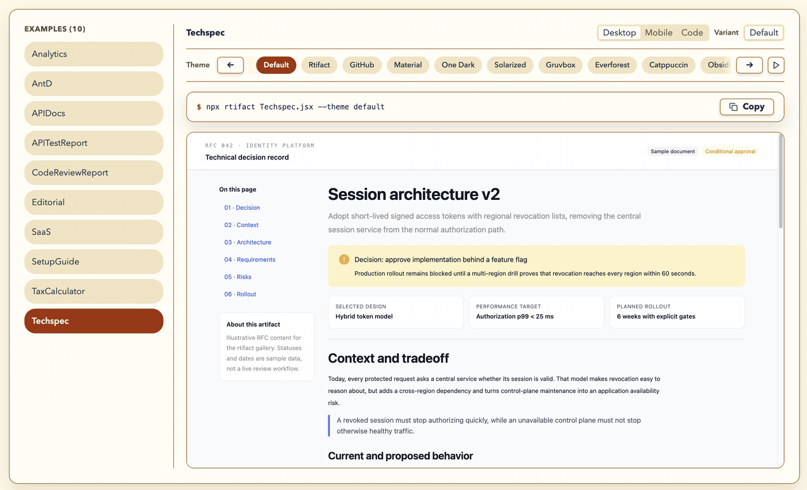

<a id="top"></a>

<p align="center">
  
</p>

<h1 align="center">Rtifact</h1>
<h3 align="center">Portable, Compressed HTML Artifacts from JSX</h3>

<p align="center"><em style="font-family: Georgia, serif; font-size: 1.2em; color: #777;">Turn .jsx into a portable, interactive .html artifact for humans.</em></p>

<p align="center">
  <a href="https://github.com/sirawats/rtifact/actions/workflows/ci.yml"></a>
  <a href="https://www.npmjs.com/package/rtifact"></a>
  <a href="https://www.npmjs.com/package/rtifact"></a>
  <a href="https://nodejs.org/"></a>
  <a href="https://github.com/sirawats/rtifact/blob/master/LICENSE"></a>
</p>

<br/>
<p align="center">
  <a href="#about">About</a> ·
  <a href="#demo">Demo</a> ·
  <a href="#ai-agent-skill">AI Agent Skill</a> ·
  <a href="#quick-start">Getting Started</a> ·
  <a href="#cli">CLI</a> ·
  <a href="#themes">Themes</a> ·
  <a href="#output-modes">Output Modes</a> ·
  <a href="#examples">Examples</a> ·
  <a href="#jsx-artifact-source">JSX Artifact Source</a> ·
  <a href="#custom-theme">Custom Theme</a> ·
  <a href="#contributing">Contributing</a>
</p>

<br/>

<a id="about"></a>

## About

> **Rtifact turns a `.jsx` file into a portable `.html` artifact.**

Why let your AI agent write HTML that consumes 2-5x tokens when it can write JSX? Let your agent write `.jsx` with React, Ant Design, Tailwind CSS, React Icons, and PrismJS. **Rtifact** handles the build and produces a finished artifact with gzip-compressed assets as one `.html` file starting at about **15.6 KB**.

```sh
npx rtifact Artifact.jsx --output artifact.html
```

**Or use it with a skill**

```text
/rtifact Create an easy-to-read documentation guide I can send to my colleague.
```

➡️ Get a finished, portable HTML artifact in one `.html` file.

[See examples at website](https://sirawats.github.io/rtifact/)

_Powered by React, Tailwind CSS, Ant Design, React Icons, and PrismJS._

<br/>

### Built With

<p align="left">
  <br/>
  <code>React</code> · <code>Ant Design</code> · <code>Tailwind CSS</code> · <code>React Icons</code> · <code>PrismJS</code>
</p>

<a id="demo"></a>

## Demo

<p align="center">
  
</p>

> **Prompt**:
>
> 1. /rtifact Create a quick, high-level new joiner onboarding guide for this repo ./hermes-agent
> 2. /rtifact-create-theme Create a theme based on this image [Image #1] and then apply hermes-agent-onboarding.jsx with new theme output to hermes-agent-onboarding.html

[Another GIF demo](assets/rtifact_48x_5s-4m50s_github_hq.gif)

<a id="ai-agent-skill"></a>

## AI agent skill

Install the official Rtifact authoring skill through the universal Skills CLI
or your agent's marketplace/plugin system.

### 🪄 Via Skills

The [Skills CLI](https://github.com/vercel-labs/skills) supports Codex, Claude
Code, Gemini CLI, Antigravity, OpenCode, Cursor, and other coding agents:

```sh
npx skills add sirawats/rtifact --skill rtifact rtifact-create-theme
```

Add `--global` to make the skill available across projects.

### 🧩 Via Marketplace/Plugin

The agent-specific adapters are distributed through Git and are not included in
the npm package.

<details>
<summary>Codex</summary>

```sh
codex plugin marketplace add sirawats/rtifact
codex plugin add rtifact@rtifact
```

</details>

<details>
<summary>Claude Code</summary>

```text
/plugin marketplace add sirawats/rtifact
/plugin install rtifact@rtifact
```

</details>

<details>
<summary>Antigravity or Gemini CLI</summary>

```sh
agy plugin install https://github.com/sirawats/rtifact

# Gemini CLI
gemini extensions install https://github.com/sirawats/rtifact
```

</details>

<details>
<summary>OpenCode</summary>

Clone the repository, then add its adapter to your project or global
`opencode.json`:

```sh
git clone https://github.com/sirawats/rtifact.git /path/to/rtifact
```

```json
{
  "plugin": ["/absolute/path/to/rtifact/.opencode/plugins/rtifact.mjs"]
}
```

</details>

Both installation paths use the canonical `skills/rtifact` skill.

<a id="quick-start"></a>

## Quick start

After installing the skill, ask your preferred AI agent:

```text
/rtifact Create an API testing report that's ready to send to my frontend engineer colleague
```

Your agent creates the JSX, builds it with Rtifact, and gives you a finished
HTML artifact you can open, upload, or send. No local server or adjacent asset
directory is needed.

Requires Node.js `^20.19.0` or `>=22.12.0`.

<a id="cli"></a>

## CLI

```text
Usage: rtifact <entry.jsx|entry.tsx> [options]
       rtifact themes | rtifact --themes
       rtifact prism-themes | rtifact --prism-themes
       rtifact pack <directory> --output <file.html> [options]

Build a JSX component into one CDN-backed compressed HTML file by default.

Options:
      --output <path>    HTML output path (default: ./<EntryName>.html)
  -o, --out-dir <path>  Build a directory instead of one HTML file
      --base <path>     Directory-mode public base path (default: ./)
      --self-contained  Embed runtime dependencies for offline use
      --theme <value>   Global theme preset or .ts/.jsx module (default: default)
      --themes           List available theme names
      --prism-themes     List available Prism theme names
      --single-file     Deprecated alias for the default file mode
      --force           Replace an existing protected output
  -h, --help            Show this help
  -v, --version         Show the installed version

Run `rtifact themes` or `rtifact prism-themes` to list available themes.
```

`--output` and `--out-dir` conflict. `--base` requires `--out-dir`.
`--self-contained` applies only to direct HTML builds; `pack` is already
self-contained.

Existing output requires confirmation. Non-interactive automation must pass
`--force`. Rtifact rejects unsafe targets such as filesystem roots, symbolic
links, the current directory, and outputs containing their source input.
Builds are staged so a failed replacement preserves the last successful result.

<a id="themes"></a>

## Pick a theme

<p align="center">
  
</p>

Build with any built-in theme preset:

```sh
npx rtifact Report.jsx --theme catppuccin-mocha
```

Themes style the document and Ant Design together: typography, colors,
spacing, surfaces, controls, focus states, and code. Run `npx rtifact themes`
to view all built-in presets (`default`, `github-light`, `github-dark`,
`catppuccin-mocha`, `obsidian-minimal`, `material`, `gruvbox`, etc.).

<a id="output-modes"></a>

## Choose an output

| Need                          | Command                                | Output     | Measured Size          | Runtime Dependencies                        |
| :---------------------------- | :------------------------------------- | :--------- | :--------------------- | :------------------------------------------ |
| **A portable file (Default)** | `npx rtifact App.jsx`                  | `App.html` | **~15.6 KB**           | Pinned React & AntD load from CDN URLs      |
| **A file that works offline** | `npx rtifact App.jsx --self-contained` | `App.html` | **189.9–686.2 KB**     | Embedded runtimes for zero network requests |
| **A deployable static site**  | `npx rtifact App.jsx --out-dir dist`   | `dist/`    | Standard static assets | Bundled into conventional asset directory   |

- **Portable HTML (Default)**: Writes a single compressed HTML file embedding app code, CSS, local assets, React Icons, and PrismJS modules while loading React & Ant Design from pinned CDN URLs (`https://esm.sh`).
- **Offline HTML (`--self-contained`)**: Embeds all runtime dependencies directly for zero-network execution.
- **Static Directory (`--out-dir dist`)**: Generates a standard asset directory (`dist/`) with `index.html` and static assets. Supports `--base <path>` for deployment subpaths.
- **Package Existing Build (`pack`)**: Run `rtifact pack dist --output index.html` to package an existing directory build into self-contained HTML.

<a id="examples"></a>

## Examples

| Example                                               | Theme                | Demonstrates                                           |
| :---------------------------------------------------- | :------------------- | :----------------------------------------------------- |
| [APITestReport.jsx](examples/APITestReport.jsx)       | `github`             | Filterable API failures and request/response evidence  |
| [CodeReviewReport.jsx](examples/CodeReviewReport.jsx) | `github-dark-dimmed` | Actionable findings, severity filters, suggested diffs |
| [SetupGuide.jsx](examples/SetupGuide.jsx)             | `gruvbox`            | Guided setup checklist, commands, troubleshooting      |
| [Techspec.jsx](examples/Techspec.jsx)                 | `github`             | Technical RFC, requirements, architecture, rollout     |
| [APIDocs.jsx](examples/APIDocs.jsx)                   | `github-dark`        | Interactive endpoint reference and code samples        |
| [TaxCalculator.jsx](examples/TaxCalculator.jsx)       | `material`           | Stateful progressive tax calculator                    |
| [SaaS.jsx](examples/SaaS.jsx)                         | `catppuccin`         | Product preview and responsive pricing                 |
| [Analytics.jsx](examples/Analytics.jsx)               | `one-dark`           | Operational metrics and service health                 |
| [Editorial.jsx](examples/Editorial.jsx)               | `obsidian-minimal`   | Long-form reading and typographic rhythm               |
| [AntD.jsx](examples/AntD.jsx)                         | `default`            | Comprehensive Ant Design component catalog showcase    |

Try one from a repository clone:

```sh
npm run build
node lib/bin.js examples/APIDocs.jsx --theme github-dark
```

<a id="jsx-artifact-source"></a>

## JSX Artifact Source

The entry must be a readable `.jsx` or `.tsx` module with a default-exported
React component. Relative imports resolve from the entry file.

```jsx
import { Button, Card } from "antd";
import { FiDownload } from "react-icons/fi";
import icon from "./icon.png";

export const RTIFACT = {
  title: "Release report",
  icon,
};

export default function Report() {
  return (
    <main className="min-h-screen p-8">
      <Card className="mx-auto max-w-xl">
        <h1>Release report</h1>
        <Button type="primary" icon={<FiDownload aria-hidden="true" />}>
          Download
        </Button>
      </Card>
    </main>
  );
}
```

The optional `RTIFACT` export sets the browser-tab title and favicon. The icon
may be an imported local image or a remote or data URL.

The CLI supplies:

- React and React DOM
- Ant Design
- Tailwind CSS
- React Icons
- PrismJS and Prism Themes

Other bare package imports resolve from the input project's `node_modules`.

### Prism themes

Set syntax highlighting independently from the page theme:

```jsx
export const RTIFACT = { prismTheme: "prism" };
```

Run `npx rtifact prism-themes` to discover installed Prism theme names. Unknown
names warn and fall back to `prism`.

<a id="custom-theme"></a>

## Custom Theme

Creating a custom theme allows you to define a product-specific visual identity, palette, and typography for your artifacts.

### Creating custom themes with AI agents

We recommend using the official agent skill `/rtifact-create-theme` to automatically generate custom theme modules. You can provide an **example image** (e.g. brand screenshot, color palette, design mockup) or a **website URL** for your AI agent to analyze:

```text
/rtifact-create-theme Read brand-design.png and create a custom light theme module for my company.
```

Your agent will analyze the visual identity and generate a complete theme file (e.g., `./custom-theme.jsx`).

### Applying custom theme modules

Pass your local custom `.ts` or `.jsx` theme module path via `--theme`:

```sh
rtifact Home.jsx --theme ./custom-theme.jsx
```

The default export of a theme module is a declarative theme manifest. Named exports remain ordinary components that your application can import directly:

```jsx
// custom-theme.jsx
import { Button } from "antd";

export default {
  id: "custom",
  // colors, typography, rhythm, component values, and provenance
};

export function CustomAction({ children }) {
  return <Button type="primary">{children}</Button>;
}
```

```jsx
// Home.jsx
import { CustomAction } from "./custom-theme.jsx";

export default () => <CustomAction>Continue</CustomAction>;
```

> [!IMPORTANT]
> Theme modules are trusted local build-time code. Selecting one compiles and
> executes its module graph before output is created.

Application JSX needs no theme provider or page-level theme class—it inherits global styling automatically. Use semantic Tailwind utilities when custom layout styling is needed (`bg-background`, `text-foreground`, `border-border`, `font-sans`, `font-mono`, `rounded-md`, etc.).

<a id="browser-and-security-notes"></a>

## Browser and security notes

> [!IMPORTANT]
> Portable HTML requires native gzip `DecompressionStream`. Default output also
> requires import-map support and network access to `https://esm.sh`. File modes
> execute inline scripts and styles, so use directory output for a strict CSP.
> Compression is not a security boundary.

Current limitations include JSX-only input, one page per invocation, no
dev-server/watch/SSR mode, no user Vite or HTML configuration, and no automatic
`public/` directory copying.

<a id="contributing"></a>

## Development and support

```sh
npm ci
npm run verify
```

See [CONTRIBUTING.md](CONTRIBUTING.md) for repository development,
[SUPPORT.md](SUPPORT.md) for usage help, and [SECURITY.md](SECURITY.md) for
private vulnerability reporting.

<a id="license"></a>

## License

MIT

[ci-image]: https://github.com/sirawats/rtifact/actions/workflows/ci.yml/badge.svg
[ci-url]: https://github.com/sirawats/rtifact/actions/workflows/ci.yml
[npm-image]: https://img.shields.io/npm/v/rtifact.svg
[npm-url]: https://www.npmjs.com/package/rtifact
[downloads-image]: https://img.shields.io/npm/dm/rtifact.svg
[node-image]: https://img.shields.io/node/v/rtifact.svg
[node-url]: https://nodejs.org/
[license-image]: https://img.shields.io/npm/l/rtifact.svg
[license-url]: https://github.com/sirawats/rtifact/blob/master/LICENSE
