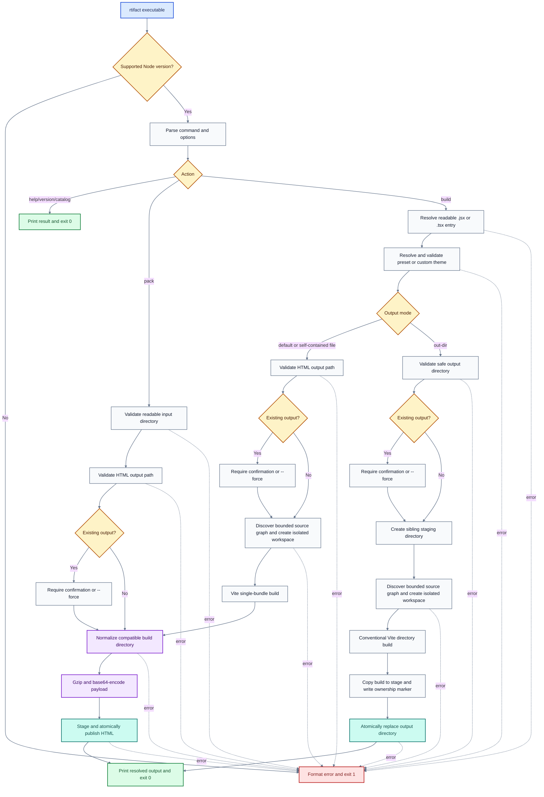
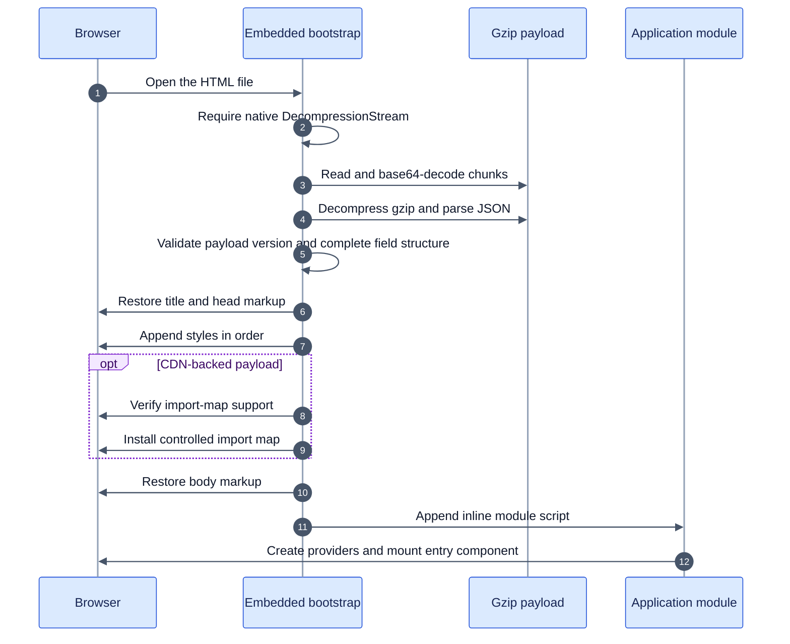

# Rtifact HTML build process

This document describes the current implementation that turns one JSX or TSX
entry into either a portable HTML file or a deployable static directory. It
also covers `rtifact pack`, which converts an existing compatible build
directory into the same portable HTML format.

The executable starts in `src/bin.ts`, and almost all orchestration lives in
`src/cli.ts` and `src/build.ts`.

## Output contracts

| Command                               | Result                   | Runtime dependencies                                                                                                   | Local neighboring files |
| ------------------------------------- | ------------------------ | ---------------------------------------------------------------------------------------------------------------------- | ----------------------- |
| `rtifact App.jsx`                     | `App.html`               | Exact-version React and Ant Design runtimes load through an embedded CDN import map                                    | None                    |
| `rtifact App.jsx --self-contained`    | `App.html`               | Bundled into the payload                                                                                               | None                    |
| `rtifact App.jsx --out-dir dist`      | Static `dist/` directory | Bundled into generated assets                                                                                          | Expected                |
| `rtifact pack dist --output App.html` | `App.html`               | Preserves only a valid controlled import map if one exists; normal Rtifact directory builds already bundle the runtime | None                    |

The default and self-contained file modes do not generate HTML directly from
the entry. Both first create a temporary Vite directory build, validate and
normalize that build, compress it, and only then publish the final HTML file.

## End-to-end flow



## 1. Process entry and argument parsing

`src/bin.ts` calls `main()`, which passes `process.argv.slice(2)` to
`runCli()`. `runCli()` first checks the current Node version against the
package's `engines.node` range, then calls `parseArgs()`.

The parser selects one of these actions:

- build one `.jsx` or `.tsx` entry;
- pack one existing directory;
- print help or version information;
- list built-in Rtifact themes; or
- list installed Prism themes.

For builds, the presence of `--out-dir` selects directory mode. Otherwise file
mode is the default. Argument validation rejects incompatible combinations
before any build begins:

- `--output` with `--out-dir`;
- `--base` without `--out-dir`;
- `--self-contained` with `--out-dir` or `--base`;
- the deprecated `--single-file` with directory options; and
- build-only options passed to `pack`.

`--single-file` no longer changes the mode. It selects the already-default file
mode and emits a deprecation warning.

## 2. Input and destination validation

### Entry

`resolveAndValidateEntry()` resolves the entry against the invocation working
directory, requires a `.jsx` or `.tsx` extension, verifies that it is a readable
regular file, and returns its canonical real path.

Rtifact does not give Tailwind the entry's parent or invocation directory.
When the build begins, a write-free Vite discovery pass follows the entry's
reachable local JavaScript and TypeScript modules. It snapshots those modules
plus the selected custom theme module under fixed file-count and byte limits.

### File destination

`resolveAndValidateHtmlOutput()` resolves `--output` against the invocation
working directory. Without `--output`, it uses the entry basename, so
`pages/Dashboard.jsx` produces `Dashboard.html` in the working directory.

The destination must end in `.html`, must not be a directory or symbolic link,
and must be a regular file if it already exists. For `pack`, canonical path
checking also rejects any destination inside the input directory.

### Directory destination

`resolveAndValidateOutput()` resolves `--out-dir` against the working directory
and rejects:

- a filesystem root;
- the invocation working directory itself;
- an ancestor directory containing the entry;
- an ancestor directory containing a custom theme module;
- a symbolic link; or
- an existing non-directory path.

An existing directory is classified as empty, Rtifact-managed, or unowned. A
valid `.rtifact-output.json` file identifies managed output.

### Replacement authorization

Existing file and directory outputs require either `--force` or an interactive
`yes` response. Non-interactive input cannot confirm, so the CLI fails and
directs the caller to `--force`. A `no` response exits with status 1 without
changing the destination.

Authorization happens before the expensive build, but the existing output is
not moved or removed until a complete replacement is ready.

## 3. Theme resolution

`resolveThemeSelection()` checks the built-in theme registry first. A built-in
name or alias returns an already-created, deeply frozen theme.

A path-like value is treated as a custom `.ts` or `.jsx` theme module:

1. Resolve and validate the readable theme file.
2. Run a separate in-memory Vite SSR build with user Vite configuration,
   environment loading, and public-directory copying disabled.
3. Load the emitted ES module through a versioned `data:` URL.
4. Require a default-exported object.
5. Convert it with `createTheme()` and validate its semantic colors, contrast,
   typography, provenance, serializable Ant Design tokens, and component
   overrides.

Theme creation produces two related representations:

- semantic values rendered into CSS custom properties for global and Tailwind
  styling; and
- serializable Ant Design algorithm, token, and component configuration used by
  the generated React provider.

Custom theme code is trusted local code. It is evaluated only inside the build
worker, so a defective theme can fail or terminate that worker without
terminating the parent CLI.

## 4. Temporary application workspace

### Outer build worker

The parent launches one direct Node child with no shell for each build or pack
job. Custom-theme evaluation, source discovery, Vite/Tailwind execution,
normalization, and compression stay in that child. Artifact bytes remain on
disk beneath an OS-temporary worker workspace; only bounded request, warning,
result metadata, and memory measurements cross the dedicated control pipe.
The child process uses that workspace as both its working directory and the
root for custom-theme loading.

The internal worker defaults are a 120-second timeout and a 768 MiB V8
old-space ceiling. They are evidence-adjusted containment safeguards rather
than public compatibility guarantees and are not exposed as CLI, environment,
or configuration options. A timeout, signal, abnormal exit, malformed or
oversized control result, or invalid prepared output fails the operation while
the parent remains alive. Diagnostics report controlled exit or signal data,
cap structured error text, strip control characters, redact inherited
credential-like environment values, and never include arbitrary child stderr.

Before publication, the parent resolves both the workspace and prepared output
with `realpath()`, rejects symbolic-link ancestors and physical escapes, then
validates and stably copies the prepared file or directory into a parent-owned
sibling stage. The worker never receives the destination path.

### Inner Vite workspace

Every JSX build uses `withTemporaryApplicationBuild()`. It creates a canonical
temporary directory named like `rtifact-work-*` beneath the parent-owned worker
workspace, so parent cleanup also removes it after abrupt worker termination:

```text
rtifact-work-*/
├── index.html
├── main.jsx
├── styles.css
├── tailwind-sources.jsx
├── theme.css
└── dist/              # created by Vite
```

The production build uses this workspace as its Vite root and writes nothing to
the source tree. The earlier discovery pass uses the entry directory only as a
resolution root and has `write: false`.

### `index.html`

The generated document contains:

- the UTF-8 and viewport metadata;
- the initial `Rtifact` title;
- the `#root` mount element;
- a module script for `/main.jsx`; and
- in default CDN-backed file mode, an exact-version import map for React,
  React DOM, Ant Design, and Ant Design CSS-in-JS.

The import map is omitted for self-contained and directory builds.

### `main.jsx`

The generated module imports `styles.css` and the virtual
`virtual:rtifact-entry` module. The virtual module is supplied by
`createEntryPlugin()` rather than written to disk.

### `theme.css`

`renderThemeCss()` serializes the selected theme's semantic values into root CSS
custom properties for colors, statuses, typography, radius, shadow, rhythm,
and control sizing.

### `styles.css`

The controlled stylesheet declares this cascade order:

```css
@layer theme, base, antd, components, utilities;
```

It then imports package-owned Tailwind CSS with automatic detection disabled,
the Rtifact foundation stylesheet, and the generated `theme.css`. One explicit
`@source` declaration covers `tailwind-sources.jsx`, the bounded snapshot of
reachable application sources and the selected custom theme module.

This arrangement keeps Tailwind away from the containing directory while still
allowing utilities in reachable local components and exported custom-theme
components to be generated without a user `tailwind.config.js`.

## 5. Controlled Vite build

### Bounded source discovery

Before creating the production workspace, Rtifact runs an isolated Vite build
with output writing, minification, user configuration, environment loading, and
public-directory copying disabled. Bare package imports and non-source assets
are externalized, so the pass follows only reachable local JavaScript and
TypeScript modules, including statically and dynamically imported modules.

A pre-load hook reads only `cjs`, `cts`, `js`, `jsx`, `mjs`, `mts`, `ts`, and
`tsx` modules outside `node_modules`. The selected custom theme source is added
explicitly. Source discovery fails before Tailwind when it encounters:

- more than 2,000 source files;
- one source file larger than 4 MiB; or
- more than 32 MiB of source in total.

The approved contents are sorted by canonical path and joined into the
temporary `tailwind-sources.jsx` snapshot. The production Vite build also
replays the captured contents for those modules, keeping application bundling
and Tailwind detection on the same source snapshot. Reachable JavaScript,
TypeScript, CSS, and JSON dependency modules are likewise returned to Vite from
bounded identity-checked reads instead of being pathname-accounted and then
read again later. Queried and binary assets receive a bounded stable pre-read,
then are revalidated by physical identity and content digest after Vite handles
their native semantics and again before bundle output. The same production
resource-budget plugin protects dependencies imported by a custom theme.

Rtifact invokes Vite programmatically with the temporary workspace as `root`
and with these isolation settings:

- `configFile: false` prevents loading a neighboring `vite.config.*`;
- `envDir: false` prevents project environment-file loading;
- `publicDir: false` and `copyPublicDir: false` disable implicit public assets;
- `appType: "spa"` builds the generated application shell; and
- `logLevel: "silent"` leaves diagnostics under Rtifact's control.

The plugin order is:

1. `jsxSourcePlugin` — redirects relative `.js` imports to a sibling `.jsx`
   file only when the `.js` file is absent and the `.jsx` file exists;
2. `rtifact-build-resource-budget` — accounts unique physical inputs, performs
   bounded stable reads, and validates generated output;
3. `rtifact-source-snapshot` — replays the bounded source snapshot;
4. `createEntryPlugin()` — supplies the virtual mount module and handles Prism
   theme metadata;
5. the React plugin; and
6. the Tailwind Vite plugin.

Package-owned aliases resolve the supplied React, React DOM, Ant Design,
Tailwind, React Icons, PrismJS, and Prism Themes installations. React and React
DOM are deduplicated so the application and providers share one React graph.

### Generated React runtime

The virtual entry module imports the user's default component and all named
exports. At browser startup it:

1. selects Ant Design's light or dark algorithm from the resolved theme;
2. creates an Ant Design theme object from the generated global and component
   tokens;
3. wraps the entry in `StyleProvider` and `ConfigProvider`;
4. verifies that `#root` exists and the default export looks like a component;
5. applies optional `RTIFACT.title` and `RTIFACT.icon` metadata; and
6. mounts the component with `createRoot()`.

If the entry contains a string-literal `RTIFACT.prismTheme`, the entry plugin
resolves that name during the build and replaces the metadata value with an
inline CSS import. Unknown names generate a warning and fall back to Prism's
default `prism` theme. A dynamic, non-literal value is a build error. At runtime
the generated module inserts that CSS into an `@layer components` style block.

### File-mode Vite settings

Default and self-contained file builds additionally configure Vite to:

- inline every asset;
- emit one CSS bundle;
- disable module preloading;
- disable JavaScript code splitting; and
- emit a single executable application graph suitable for the packager.

In default mode, the controlled runtime imports are externalized and resolved
later by the embedded browser import map. In `--self-contained` mode nothing is
externalized, so those runtimes are bundled into the application payload.

### Directory-mode Vite settings

Directory mode keeps Vite's conventional production asset behavior and applies
the user-selected `--base` value, defaulting to `./`. Runtime dependencies are
bundled through the package aliases, and code splitting and neighboring assets
are allowed.

## 6. Portable HTML normalization and packaging

File-mode builds pass the temporary `dist/` directory to
`createSingleFileArtifact()`. The standalone `pack` command starts at this same
step with its validated input directory.

`normalizeBuildDirectory()` performs the following checks and transformations:

1. Recursively index regular files and reject symbolic links.
2. Require a readable root `index.html`.
3. Require exactly one external executable script and at most one import map;
   reject any other script tags.
4. If an import map exists, require it to exactly match Rtifact's controlled
   exact-version CDN mapping.
5. Require exactly one `.js` or `.mjs` executable bundle in the directory.
6. Remove module-preload links.
7. Read local stylesheets in document order, tokenize CSS identifiers and
   functions (including escaped forms), reject remaining local or ambiguous
   `@import` rules, inline local `url(...)` resources as data URLs, and remove
   their link tags.
8. Extract the title, remaining head markup, and body markup.
9. Reject `srcset`, then inline local `src`, `poster`, and resolvable `href`
   assets in that markup.
10. Read the executable bundle and inline referenced non-JavaScript,
    non-stylesheet local assets.
11. Validate executable imports against the controlled import map when one is
    present.
12. Reject unsupported additional chunks and explicitly detectable syntax for
    dynamic imports, workers, service workers, runtime-loaded WASM, and relative
    runtime `fetch()` calls. These checks validate emitted bundle compatibility;
    they do not sandbox trusted JavaScript or prove the absence of equivalent
    aliased or computed browser API calls.

Remote HTTP(S), protocol-relative, `data:`, `blob:`, and fragment references are
left intact. Required local references must resolve inside the build directory;
path escapes and unresolved required assets fail packaging.

The normalized payload has this shape:

```ts
interface EmbeddedPayload {
  version: number;
  title: string;
  head: string;
  body: string;
  styles: string[];
  importMap?: { imports: Record<string, string> };
  scriptType: string;
  script: string;
}
```

The packager JSON-serializes the payload, compresses it with gzip level 9,
base64-encodes the compressed bytes, and places them in an inert
`application/octet-stream` script element inside the final HTML shell. The
payload version is currently sourced from `SINGLE_FILE_PAYLOAD_VERSION`.
Packaging rejects more than 4,096 files, any input file over 16 MiB, more than
64 MiB of aggregate input, a normalized JSON payload over 96 MiB, or final
portable HTML over 128 MiB. Repeated encoded asset insertions are charged each
time before the next normalized representation is appended.

## 7. Browser startup for portable HTML



The bootstrap starts with a visible loading message. It uses the browser's
native `DecompressionStream("gzip")`, validates the payload version and every
payload field before mutating the document, restores document data in dependency
order, and finally appends the executable script.

If decompression, parsing, version validation, import-map support, or module
loading fails, the bootstrap replaces the document with a readable error rather
than leaving a blank page or starting a partial application.

## 8. Directory publication

Directory builds write nothing directly into the destination. The worker process
first builds the application into a prepared directory beneath its isolated workspace.
The parent process then invokes `publishPreparedDirectory()`, which creates a
sibling `.rtifact-stage-*` directory, copies the prepared directory into the stage,
validates the staged files, and writes `.rtifact-output.json` containing:

- the package name;
- the output marker format version; and
- the package version that created the output.

Only after the stage is complete does `commitOutput()` publish it:

- revalidate the destination's authorized identity and canonical path at the
  mutation boundary;

- if the destination is absent, rename the stage into place;
- if it exists, rename the old output to a unique backup, rename the stage into
  place, restore the backup if that second rename fails, then remove the backup
  after success.

Rtifact attempts restoration once. If publication and backup restoration both
fail, the publication error remains the primary diagnostic, the diagnostic
names the unique recoverable backup, and Rtifact leaves that backup untouched
for manual recovery rather than moving it again during cleanup.

A failed compile or copy therefore leaves the previous successful output
untouched.

## 9. HTML file publication

For direct file builds and `pack`, the build worker fully normalizes and compresses
the artifact within its isolated workspace. The parent process then receives the
prepared output metadata and invokes `publishPreparedFile()`.

Publication writes the prepared HTML to a unique sibling staging file using
exclusive creation. It revalidates the authorized file identity and canonical
path before calling `commitFileOutput()` to replace the target. If a destination
exists, it is renamed to a unique backup; the stage is then renamed into place. A
failed publication restores the backup, and final cleanup removes the stage and
any obsolete backup when possible.

Parent directories are created as needed, but unrelated sibling files are not
removed.

## 10. Cleanup and diagnostics

Rtifact always removes worker and Vite workspaces after the consumer finishes,
whether the build, packaging, or consumer succeeds or fails.
Directory and file publication stages are likewise cleaned on failure. Cleanup
uses bounded retries for transient filesystem locks. If cleanup also fails, the
original build, publication, or recovery error remains primary and cleanup
context is appended; a named recoverable backup is never removed by final
cleanup.

The source-discovery build uses `write: false`, so a rejected source graph has
no discovery output to remove. If directory mode already created a publication
stage, the normal failure cleanup removes it.

Non-Rtifact build failures are wrapped as `BUILD_FAILED` while retaining their
cause. `formatError()` preserves useful Vite source IDs, source locations, and
nested causes while omitting source code frames. Packaging failures use `PACK_FAILED`; direct file
builds append a recommendation to retry with `--out-dir dist` when the
application graph cannot be represented by the portable format.

The outer CLI catches every failure, writes one `rtifact: ...` diagnostic to
stderr, and returns exit status 1. Successful file and pack operations report
the resolved output and byte size; successful directory builds report the
resolved output directory.

## Implementation map

| Concern                                                | Source                                                                                                     |
| ------------------------------------------------------ | ---------------------------------------------------------------------------------------------------------- |
| Executable entry                                       | [`src/bin.ts`](../src/bin.ts)                                                                              |
| CLI parsing and dispatch                               | [`src/args.ts`](../src/args.ts), [`src/cli.ts`](../src/cli.ts)                                             |
| Worker process containment and job dispatch            | [`src/build-worker.ts`](../src/build-worker.ts), [`src/build-worker-main.ts`](../src/build-worker-main.ts) |
| Resource and size limits                               | [`src/resource-limits.ts`](../src/resource-limits.ts)                                                      |
| TOCTOU-safe file reading                               | [`src/stable-files.ts`](../src/stable-files.ts)                                                            |
| Path validation                                        | [`src/paths.ts`](../src/paths.ts)                                                                          |
| Replacement confirmation                               | [`src/confirmation.ts`](../src/confirmation.ts)                                                            |
| Temporary workspace and Vite invocation                | [`src/build.ts`](../src/build.ts)                                                                          |
| Generated HTML, CSS, and virtual entry modules         | [`src/templates.ts`](../src/templates.ts)                                                                  |
| Package aliases and CDN import map                     | [`src/dependencies.ts`](../src/dependencies.ts)                                                            |
| Theme loading and validation                           | [`src/theme-modules.ts`](../src/theme-modules.ts), [`src/themes.ts`](../src/themes.ts)                     |
| Portable payload normalization and bootstrap packaging | [`src/single-file.ts`](../src/single-file.ts)                                                              |
| Staged publication and cleanup                         | [`src/output.ts`](../src/output.ts)                                                                        |
| Error normalization                                    | [`src/errors.ts`](../src/errors.ts)                                                                        |
